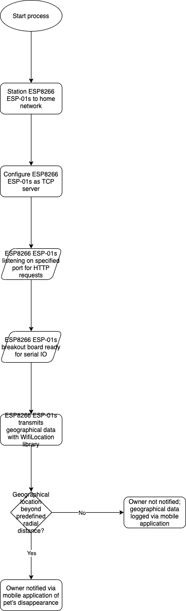
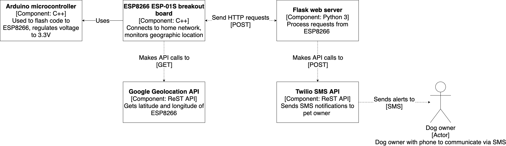

# Pet Monitoring System

Pet monitoring system that notifies owners via SMS if their pet has escaped the house or not.

## Authors: Noah Teshima, Luis Jibaja

## Overview

### Parts used

- **ESP8266 ESP-01S breakout board**. This breakout board allows microcontrollers to access a Wi-Fi network.
- **Arduino Uno R3 microcontroller**. Beyond interfacing with the ESP8266 ESP-01S, this microcontroller was solely used to regulate voltage to 3.3v. As an alternative, an [FTDI USB to serial converter can be used](https://www.amazon.com/HiLetgo-FT232RL-Converter-Adapter-Breakout/dp/B00IJXZQ7C), in addition to some minor revisions to the existing schematic diagrams.

### Flowchart

The attached flowchart illustrates the high-level approach we had for this project.

The ESP8266 breakout board must be stationed to a home network. This is due to the fact that this project has a backend to process geographic location data in addition to making any necessary ReST API calls. Once stationed to a home network, this project constantly monitors the geographic location of the ESP8266 using Google's geographic location API. When appropriate, an SMS notifcation is sent in order to notify owners when a pet has escaped.

### Component Diagram

The corresponding component diagram illustrates the architecture for this project.

With regards to the ESP8266 module, geographic location is constantly being monitored with Google's geographic location API. This location data is subsequently sent via a POST request to be processed with a Flask server. If the geographic location of the ESP8266 module goes beyond some radial distance, API calls are made with Twilio in order to send an SMS message to the owner.

### Setup/Installation

[Here is a link to documentation for setup and installation for this project.](specs/documentation/installation.md)

## Prototype Demo

https://www.youtube.com/watch?v=Ke7Aju_7rag&t=1s