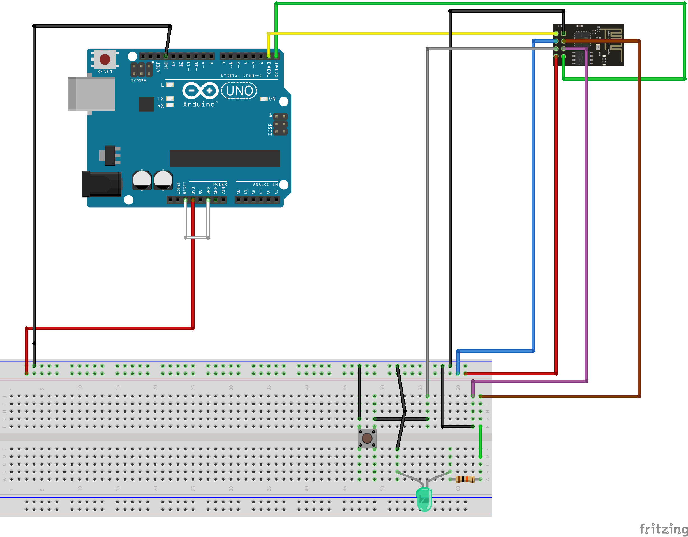

# Installation and getting started
## Introduction
This markdown intends to provide the necessary information in order to start running this project.

## Installation and setup
1. This project requires a publicly hosted URL of our webserver `./Server/flask_server.py`. If a publicly hosted URL is not feasible, *for testing purposes* download [ngrok](https://ngrok.com/download). This allows us to tunnel a locally-hosted webserver to a remote URL.
2. We use flask to deploy our web server and talk to downstream services. An installation guide can be found [here](https://flask.palletsprojects.com/en/1.1.x/installation/).
3. We also use the Arduino IDE, which can be installed [here](https://www.arduino.cc/en/software).
4. The ESP8266 ESP-01S requires additional libraries for geographic location and HTTP request/response handling.
   1. Open the Arduino IDE
   2. Navigate to File > Preferences > Additional Board Manager URLs
   3. Add http://arduino.esp8266.com/stable/package_esp8266com_index.json to the list
   4. Click OK
5. The ESP8266 ESP-01S also requires a new board from Board Manager
   1. Open the Arduino IDE
   2. Navigate to Tools > Board > Boards Manager
   3. Search for 'esp8266', and install the latest version. (As a sanity check, the board should also be open sourced [here](https://github.com/esp8266/Arduino))
   4. When running the sketches for this project, make sure 'Generic ESP8266 Module' is selected under Boards Manager.
6. We use two third party API's: [Google geolocation API](https://developers.google.com/maps/documentation/geolocation/overview) and [Twilio's ReST API for SMS](https://www.twilio.com).
   1. Create an account if no account is owned for either service. For the geolocation API, use the [Google cloud platform](https://cloud.google.com/).
   2. For the geolocation API, ensure that [the API is enabled on your developer account](https://cloud.google.com/endpoints/docs/openapi/enable-api).
   3. For Twilio's ReST API, add a [verified phone number](https://support.twilio.com/hc/en-us/articles/223180048-Adding-a-Verified-Phone-Number-or-Caller-ID-with-Twilio). For testing purposes, a personal phone number is sufficient. Secondly, you must purchase a phone number to use with the API [here](https://www.twilio.com/console/phone-numbers/search).

## Uploading code to the ESP8266 ESP-01S
Due to the amount of GPIO pins on the ESP8266 ESP-01S, adding a sketch to this breakout board is difficult without an FTDI Mini USB to TTL serial converter adapter or guidance. Fortunately, we included a fritzing diagram that does not require this adapter.

The above fritzing diagram allows us to enable programming mode to upload directly to the ESP8266 ESP-01S.
1. Implement the above Fritzing diagram.
2. Open the sketch `./sketches/geographicLocation/geographicLocation.ino`.
3. Before uploading, mke sure 'Generic ESP8266 Module' is selected under Boards Manager.
4. Upload the sketch.
5. While the ESP8266 ESP-01S is connecting (shown in the console), press and hold the push button momentarily. This grounds the reset pin and ensures the ESP8266 ESP-01S is in programming mode.
6. Once the sketch is done uploading, disconnect the black common ground pin that is in series with the GPIO0 pin. This turns off programming mode for the ESP8266 ESP-01S. (For reference, the GPIO0 pin is connected with a purple jumper wire in our Fritzing diagram).
7. Press and hold the push button for one second. This resets the ESP8266 ESP-01S and runs our sketch.
8. The sketch should now be running and making POST requests to our publicly-hosted web server.

## Setting up the web server
This project uses a Flask web server for Twilio (as a downstream service) and data massaging.
1. From bash/any other CLI, Navigate to the folder `./Server`
2. Run the following command block:
```
$ export FLASK_APP=flask_server.py
$ export FLASK_ENV=development
$ flask run
```
3. Navigate to the folder containing the UNIX executable for ngrok.
4. Run `./ngrok http [PORT]` where `[PORT]` is the port that is hosting our Flask application.
5. ngrok should log a public URL that we can add to our sketch. Note that a link will be logged for both the HTTP and HTTPS protocol. For testing purposes, the HTTP link is quicker and easier to set up.
6. At this point, it is important to make sure the endpoints are properly hitting. As of this writing, our webserver only has one endpoint `/arduino` that handles POST requests sent from the ESP8266 ESP-01S. In order to test whether the web server is properly tunneled, run the following curl command, where `[NGROK HTTP URL]` denotes the public URL given by ngrok.
```
curl -X POST -H "Content-Type: application/json" -d '{"location": {"lat": 12.3456, "lng": -12.3456}, "accuracy": 10.0}' [NGROK HTTP URL]/arduino
```

